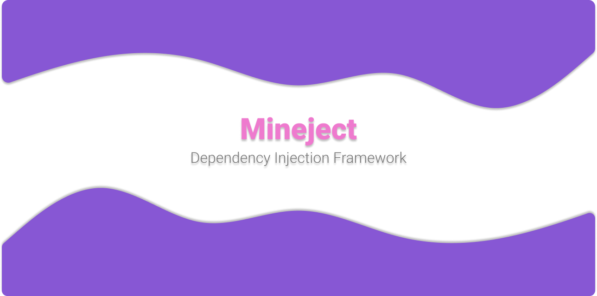

**Mineject is a Framework that makes it easy to create projects for platforms such as Spigot, BungeeCord, etc.**  
**The project that particularly inspired me was [EternalCore](https://github.com/EternalCodeTeam/EternalCore) by [EternalCodeTeam](https://github.com/EternalCodeTeam), where they implemented the technique of dependency injection.**  

**This being my first project of this kind, I acknowledge that it may not be perfect, but I'm still pleased with the final outcome.**
  

 

> [!IMPORTANT]  
> Since the project is in its early stages of development, documentation and functionalities will be added progressively.

> [!TIP]
> If you encounter any issues, feel free to create an [issue](https://github.com/failutee/Mineject/issues) on GitHub or join to my [discord](https://discord.gg/ctY3D5EjAA).

  <a href="https://failutee.gitbook.io/mineject/" style="text-decoration: none; color: inherit;">
    
    
Click here to view full documentation

  </a>

 <a href="https://star-history.com/#failutee/Mineject&Date">
  <picture>
    <source media="(prefers-color-scheme: dark)" srcset="https://api.star-history.com/svg?repos=failutee/Mineject&type=Date&theme=dark" />
    <source media="(prefers-color-scheme: light)" srcset="https://api.star-history.com/svg?repos=failutee/Mineject&type=Date" />
    
  </picture>
 </a>

